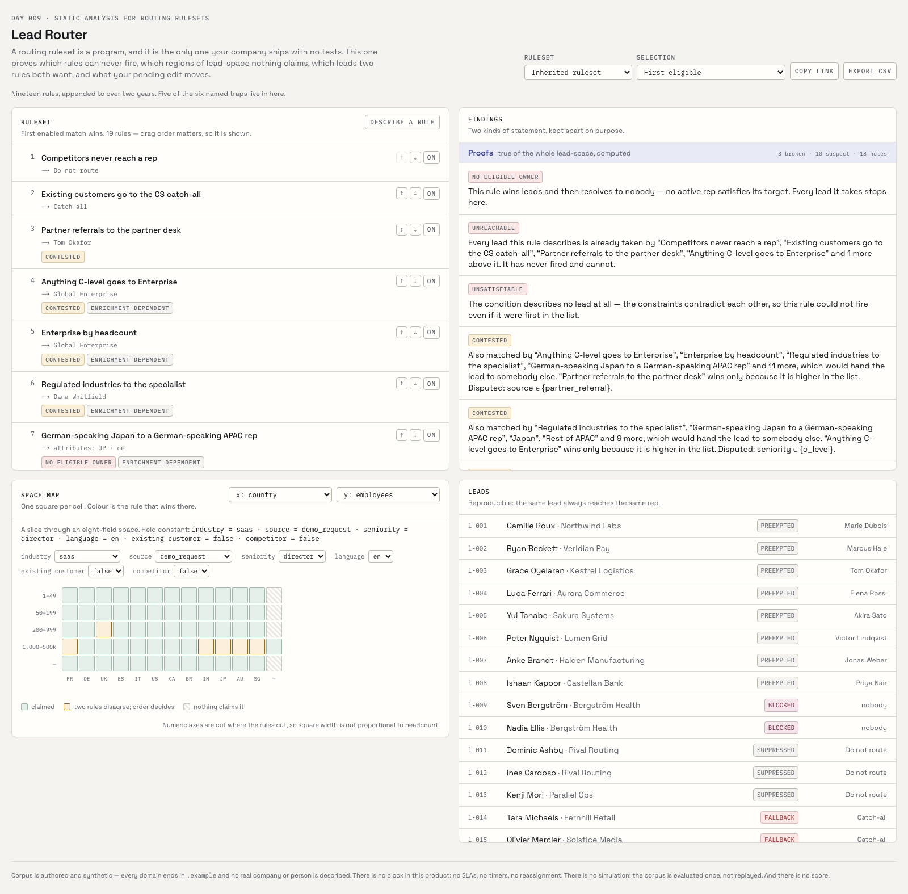
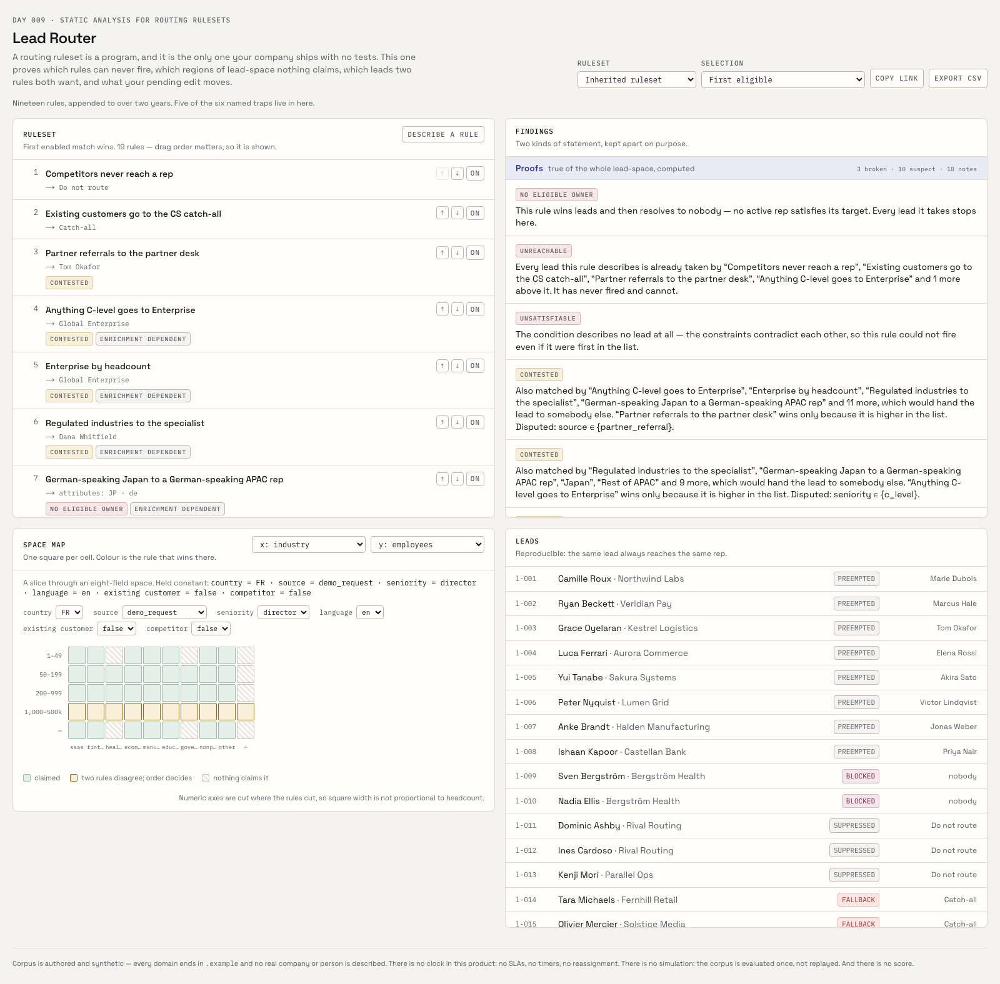
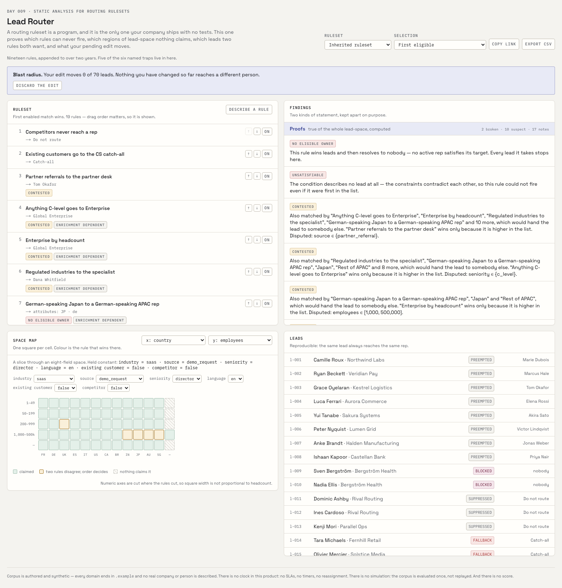
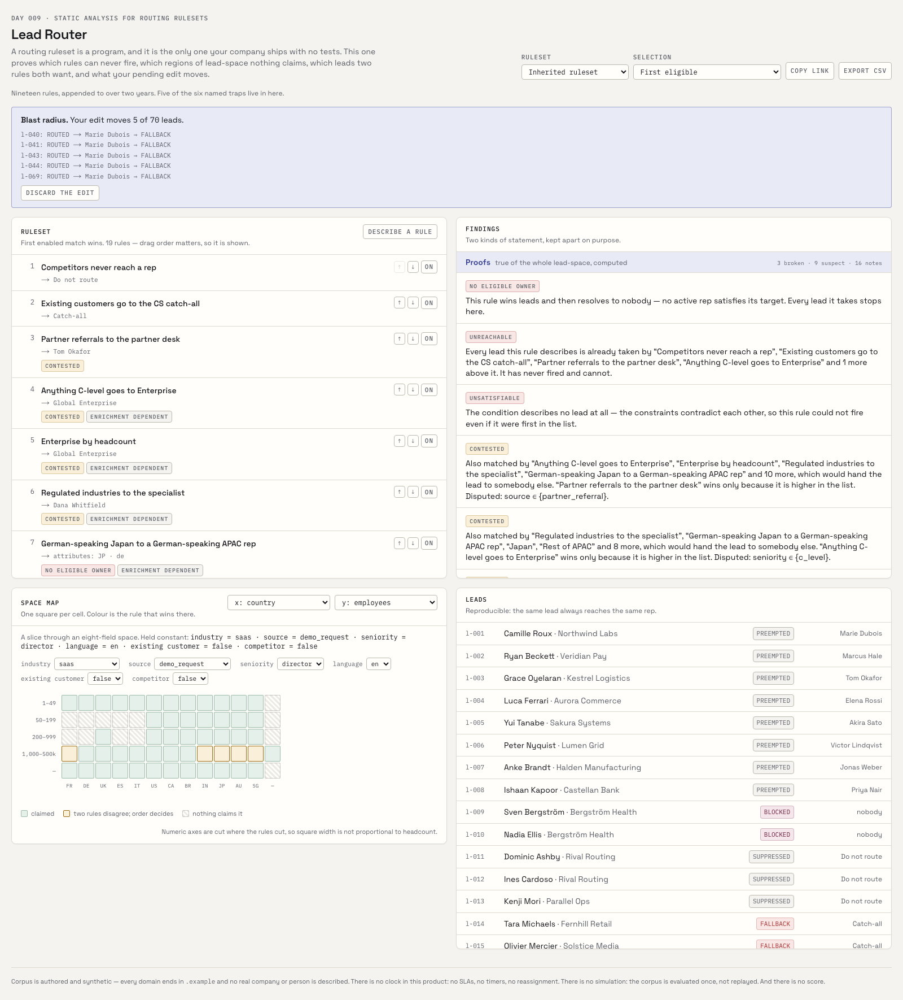

# Lead Router

Static analysis for lead-routing rulesets — it proves which rules can never fire, which regions of lead-space nothing claims, which leads two rules both want, and what a pending edit will move.

[Live demo](https://lead-router-sigma.vercel.app) · Day 009 of a 100-day building challenge



## Why I Built This

Every B2B company routes inbound leads with an ordered list of rules. It lives in a Salesforce assignment ruleset, a HubSpot workflow, a Chili Piper config, or three hundred lines of Zapier. It is a **program** — branching control flow over typed inputs with a fallthrough default — and it is the only program in the company that ships with no tests, no coverage report, no linter, and no review. It is edited under pressure by whoever is on the ops rotation that quarter, and it is never deleted from, only appended to.

Four things go wrong inside that list.

**Rules die silently.** Somebody adds a broad rule near the top in month three: *all enterprise leads to the enterprise team*. In month nine somebody adds a narrow one near the bottom: *French enterprise leads to Noor*. Noor's rule never fires. Not once. It sits in the config looking authoritative, it gets quoted in QBRs, and no output anywhere in the system distinguishes a rule that fires from a rule that cannot. Nobody finds out until Noor asks why she has no leads.

**The ruleset has holes and nobody knows their shape.** Some region of lead-space is claimed by no rule and falls to the catch-all. Everyone knows the catch-all exists; nobody can say what is *in* it. "Leads we didn't plan for" is not a description you can act on.

**Overlap is resolved by accident.** Two rules match the same lead and disagree about the owner. Whichever is higher wins, and the ordering was decided by the order people happened to add them. That is not a routing decision — it is a merge conflict resolved by line number, executed thousands of times a month, invisibly.

**Assignment is confused with eligibility.** Every routing tool shows one answer: *this lead went to Dana*. Two separate mechanisms produced it. The rules narrowed the lead to a set of eligible owners — deterministic. A round-robin counter picked Dana out of that set — stateful. Run the same lead through again and you get Priya. Every vendor demo presents the assignment as a function of the lead. For most configurations it is not, and nothing on screen says so.

## What It Does

Load a ruleset — the shipped one is nineteen rules written the way inherited rulesets actually are, appended to over two years by four people who each solved one problem. The console immediately reports:

**Proofs** — statements about the whole lead-space, computed exactly:

| finding | meaning |
|---|---|
| `UNSATISFIABLE` | the condition describes no lead at all; the constraints contradict |
| `UNREACHABLE` | fully covered by higher-priority rules — can never win |
| `PARTIALLY_SHADOWED` | partly eaten above; the surviving region is described |
| `REDUNDANT` | it fires, but deleting it changes no assignment anywhere |
| `CONTESTED` | ≥2 rules match and disagree; line order alone decides |
| `UNCOVERED` | cells no rule claims, described as a shape |
| `ENRICHMENT_DEPENDENT` | cannot fire until a field comes back from enrichment |
| `NO_ELIGIBLE_OWNER` | the rule wins leads and resolves to nobody |

**Observations** — statements about the 70 leads in the corpus, counted: how many actually fell in each hole, which leads a contest actually decided, and which rules are live in the space but starved in practice because pre-emption takes every lead first.

The two are rendered in separate sections and are **never summed into one number**. *"Eleven of your leads fell into a hole"* is disprovable by next week's traffic; *"your ruleset has a hole"* is a property of the artifact.

Edit any rule and everything re-derives with no round trip, plus a **blast radius**: this edit moved *N* of 70 leads, and here they are.

## Demo

**The hole, as a shape.** Put industry on one axis and headcount on the other. The hatched cells are claimed by nothing — regulated companies under fifty people, and every lead whose industry has not come back from enrichment.



The hole has a cause, not a placement. A specialist desk was added later, and the regional rules were amended with `industry notIn {healthcare, government}` to get out of its way. But the specialist rule starts at fifty people. `notIn` also excludes the unenriched value. Nobody intended either.

**A dead rule, proved dead.** *France enterprise to Noor* is struck through. Switch it off and the blast radius says **0 of 70 leads moved** — which is what "unreachable" means, checked against the corpus rather than asserted.



**A live rule, for contrast.** Switch off *EMEA mid-market* and five leads move — every one of them from a named rep to the catch-all.



## How It Works

The interesting question is always the same shape: *which leads does rule 14 win, given that rules 1–13 ran first?* Over an unrestricted expression language that needs an SMT solver and still comes back approximate.

So the language is restricted until the question is arithmetic. **A rule condition is a conjunction of at most one constraint per field** over eight declared domains. No disjunction inside a rule (write two rules), no cross-field comparison, no arithmetic, no regex.

Every condition then names a finite set of boundaries. Cut each field's domain at exactly those boundaries and you get a small number of **atoms** per field, with one useful property: no condition in that ruleset can split one.

```
country     │ FR │ DE │ UK │ ES │ … │ ⊥ │      ← one atom per value, plus unenriched
employees   │ 1–49 │ 50–199 │ 200–999 │ 1000–500k │ ⊥ │
                     ▲         ▲
                     │         └── because one rule says [200, 999]
                     └── because another says [50, 999]
```

Every rule is now exactly a union of atoms — a hyperrectangle over atom indices — and shadowing, coverage and contest become intersection and difference. Exact. No solver, no sampling.

The analyser then makes one sweep down the ordered list, keeping a running region of what the rules above have claimed. A rule's own region minus that is the part it can actually win: empty means dead, smaller means partly shadowed, and what is left at the bottom of the list is the hole.

### The pipeline

```
lead
 ├─ 1. PRE-EMPTION   emailDomain → account → active owner?    ──► PREEMPTED  (stop)
 │                                          → departed owner? ──► BLOCKED    (stop)
 ├─ 2. MATCHING      evaluate ALL rules  → full match set     (analysis)
 │                   first enabled match → winning rule       (decision)
 ├─ 3. ELIGIBILITY   winning rule.target → eligible rep set   (pure) ── empty? ──► BLOCKED
 ├─ 4. SELECTION     strategy + capacity → one rep            (stateful)
 └─ (no rule matched)                                         ──► FALLBACK
```

Steps 1–3 are a pure function of `(lead, ruleset, org)`. Everything the analyser claims is a claim about them. Step 4 is the only place state enters — and the only place the same lead can produce two different answers.

## Architecture

```
                    ┌─ server component ──► data/*.ts (Zod-validated at import)
Browser ────────────┤
                    ├─ lib/routing (pure) ──► same functions client- and server-side
                    │
                    └─ POST /api/translate ──► key check ──► rate limit ──► model ──► Zod ──► Rule (unrun)
```

`lib/routing/` is the engine and is **dependency-free and framework-free** — it imports `zod` and nothing else. Not `next`, not `react`, not the corpus, no host globals, no clock, no randomness. An eslint rule enforces it and `purity.test.ts` enforces it harder, by reading the directory off disk and allowing exactly two things. That is not tidiness: an analyser that cannot reach a network client or a database cannot emit a finding that is not a consequence of its arguments, which is what entitles the console to call the output proofs.

The engine ships to the browser. Editing a rule must re-derive every finding and every assignment with no round trip, or the analysis reads as a report *about* the ruleset rather than a property *of* it.

See [`lib/routing/README.md`](lib/routing/README.md) for the module map and the algebra in more detail.

## Key Decisions & Tradeoffs

- **Decision:** restrict the rule language until the analysis is exact.
  **Why:** a "probably unreachable" finding is worth nothing; nobody deletes a rule on a maybe.
  **Tradeoff:** this language cannot express things Salesforce can — `revenue > employees * 50000`, a regex on the email domain, `(A and B) or C` inside one rule. That weakness is what buys the proofs, and the README says so rather than hiding it.

- **Decision:** proofs and observations are separate, and never summed.
  **Why:** they are different kinds of claim. One is disprovable by next week's traffic.
  **Tradeoff:** two counts instead of one number. There is no "routing health score," and there will not be.

- **Decision:** never report a percentage of lead-space.
  **Why:** atom count is not lead volume. A proportion assumes leads are spread evenly across every combination of country, size and industry, which no funnel has ever been.
  **Tradeoff:** a hole gets a *description* and a *corpus lead count* — less quotable, actually true.

- **Decision:** missing values are a value in the domain, not a third truth value.
  **Why:** two-valued logic keeps every set operation exact.
  **Tradeoff:** `notIn {healthcare}` does not match a lead whose industry is unresolved. That is what real routing does, and it is where holes come from — but it surprises people, so `ENRICHMENT_DEPENDENT` says it out loud.

- **Decision:** `BLOCKED` does not fall through to the rules.
  **Why:** a pre-emption pointing at a departed rep is a black hole, and falling through is how it survives for two years without anyone learning it exists.
  **Tradeoff:** a production system needs a declared fallback policy here. Choosing one was out of scope for a one-day build; surfacing the problem was the point.

- **Decision:** capacity is soft and lives on the selection side.
  **Why:** if a load figure could produce an outcome, it could change what the analyser proves.
  **Tradeoff:** a full team still receives the lead. The sweep asserts findings are byte-identical at capacity 0 and capacity 10,000.

- **Decision:** three suppressions in the finding logic — a strict refinement above is an idiom, not a conflict; a rule constraining no field this rule mentions is a guard; a rule targeting a queue is not claiming ownership.
  **Why:** without them the shipped corpus produces 36 contests and a shadow note on nearly every rule. All true, all noise, and noise teaches the reader to ignore the panel.
  **Tradeoff:** three judgement calls in what is otherwise pure algebra. Each is documented at the line that makes it.

## Getting Started

### Prerequisites

Node 20+ and npm.

### Installation

```bash
git clone https://github.com/akshatiwarix/lead-router.git
cd lead-router
npm install
```

### Configuration

Optional. Copy `.env.example` to `.env.local` and set `GEMINI_API_KEY` to enable the "describe a rule" box. **Everything else works without it** — every finding, the space map, the blast radius, all five rulesets, the permalink and the CSV. With no key that one box returns a 501 pointing at the rule editor.

### Run Locally

```bash
npm run dev        # http://localhost:3000
npm run build      # production build
npm test           # 130 tests, including one per named trap
npm run sweep      # 667 invariants, brute-forced against the corpus
npm run typecheck
npm run lint
```

## Usage

Pick a ruleset from the header. Four single-pathology presets ship alongside the inherited one, so you can see each finding in isolation before meeting all of them at once.

- **Inherited ruleset** — nineteen rules, five of the six named traps.
- **Clean ruleset** — nothing broken, nothing contested, and still three notes, because every geographic rule needs a country that enrichment has not always returned.
- **One dead rule** — the most common defect in an inherited ruleset, alone.
- **Two teams, one region** — a contest with nothing else in the way.
- **A hole with a shape** — every rule needs a resolved headcount, so nothing routes a lead whose enrichment has not come back.

Then: reorder rules with ↑ ↓, toggle them on and off, click one to edit its condition, switch the space-map axes to look at a different plane, change the selection strategy to watch the leads pane relabel itself **not reproducible** while every finding stays identical, and copy a permalink that carries the whole ruleset.

## Validation / Testing

Unit tests per module, one test named after each of the six traps, and an invariant sweep that checks the *proofs are true* rather than that the code runs.

The soundness pairs are the ones that matter. `UNREACHABLE` means "deleting this rule changes nothing", so the sweep deletes it and looks. `REDUNDANT` means the same for a rule that does fire. The converse is stated carefully on purpose: *"a rule the analyser did not flag must move somebody when deleted"* is **wrong**, and being wrong there would be the exact mistake this repo exists to refuse — `UNREACHABLE` is a claim about the lead-space, and seventy leads cannot falsify one. So the sweep asserts the space-level converse (a live rule has a non-empty effective region) and prints the corpus-level observation without asserting it.

Also checked: every lead occupies exactly one cell; claimed regions plus the hole equal the whole space, for all five rulesets; a hundred runs of steps 1–3 are byte-identical; findings are unchanged at capacity 0 and 10,000; `FIRST_ELIGIBLE` answers the same question the same way and `ROUND_ROBIN` demonstrably does not; no finding anywhere contains a percentage.

```
667/667 invariants held
```

## Limitations

- **No clock.** No SLAs, no timers, no reassignment, no working hours, no speed-to-lead. Day 029 `lead-sla-monitor` owns time.
- **No simulation.** The corpus is evaluated once, not replayed. No queue depth, no load charts, no starvation analysis. Day 033 `routing-simulator` owns volume.
- **No territory construction.** Territories are input fields on a rep. Day 016 `territory-builder` owns drawing them.
- **Eight fields.** Adding a ninth is a line in `domains.ts`; adding a *kind* of field (dates, hierarchical enums, set-valued) is real work in the algebra.
- **The corpus is authored and synthetic.** Every domain ends in `.example`; no real company or person is described. There is no CRM import.
- **Single user, no persistence.** State lives in the tab and in the permalink.
- **`BLOCKED` has no fallback policy.** Surfacing the black hole is the product; deciding what to do about it is not in this build.

## What I'd Build Next

- Import a real Salesforce assignment ruleset, with an explicit report of which rules fall outside the decidable fragment rather than a silent approximation.
- Propose the minimal condition edit that resolves a contest, instead of only naming it.
- Analyse a *sequence* of edits rather than one, so a quarter of ruleset changes can be reviewed like a diff.
- More field kinds — dates, hierarchical enums, set-valued fields.

## License

MIT. See [LICENSE](LICENSE).
